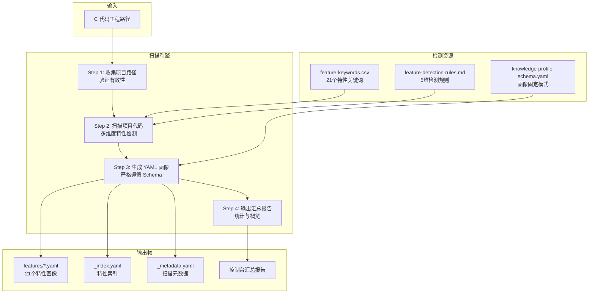
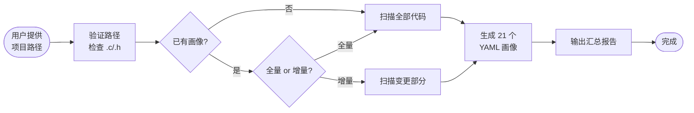
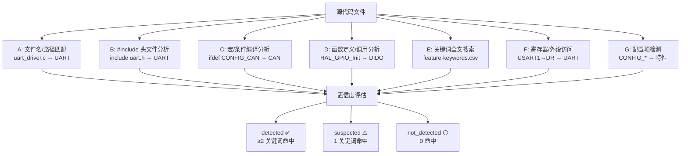
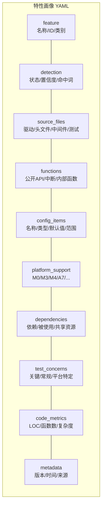
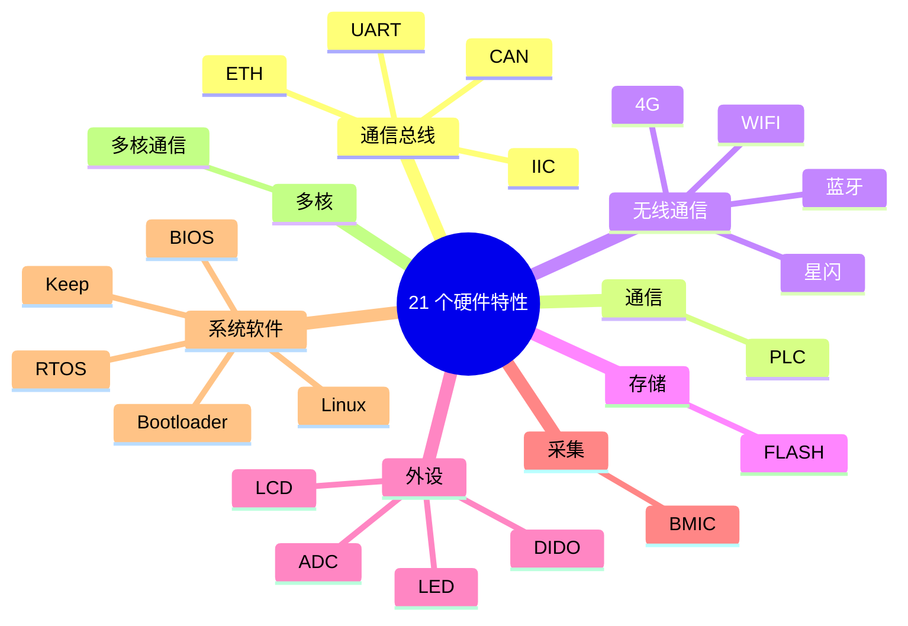
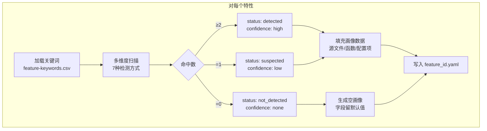
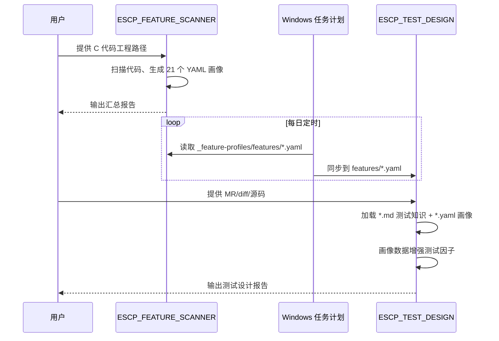
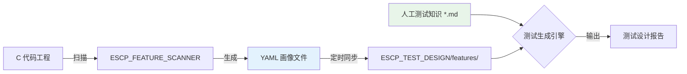

# ESCP_FEATURE_SCANNER — 特性画像自动生成 Skill

> 扫描嵌入式 C 代码工程，固定生成 21 个硬件特性的 YAML 画像文件，构建结构化知识基线。  
> 全自动执行 · 只读扫描 · 固定 21 特性 · YAML 标准化输出

---

## 系统架构



---

## 工作流程



---

## 多维度特性检测



---

## YAML 画像结构



### 画像字段说明

| 模块 | 字段 | 说明 |
|------|------|------|
| `feature` | name / id / category | 特性基本标识 |
| `detection` | status / confidence / keywords_matched | 检测结果与置信度 |
| `source_files` | drivers / headers / middleware / configs / tests | 关联源文件清单 |
| `functions` | public_api / interrupt_handlers / internal | 函数接口列表 |
| `config_items` | name / type / default / range / impact | 配置项及影响 |
| `platform_support` | M0 / M3 / M4 / A / A7 / HI1230 / multi_core | 平台支持矩阵 |
| `dependencies` | requires / used_by / shared_resources | 依赖与资源共享 |
| `test_concerns` | critical / common / platform_specific | 测试关注点 |
| `code_metrics` | loc / functions_count / complexity | 代码度量 |

---

## 21 个固定特性



---

## 检测与生成规则



> **核心规则**：无论代码是否涉及，全部 21 个特性均生成画像文件。未涉及的特性画像字段留默认空值。

---

## 输出目录结构

```
{project-root}/_feature-profiles/
├── features/
│   ├── can.yaml
│   ├── uart.yaml
│   ├── iic.yaml
│   ├── eth.yaml
│   ├── plc.yaml
│   ├── wifi.yaml
│   ├── bluetooth.yaml
│   ├── nearlink.yaml
│   ├── 4g.yaml
│   ├── flash.yaml
│   ├── adc.yaml
│   ├── dido.yaml
│   ├── lcd.yaml
│   ├── led.yaml
│   ├── bmic.yaml
│   ├── bios.yaml
│   ├── bootloader.yaml
│   ├── rtos.yaml
│   ├── linux.yaml
│   ├── keep.yaml
│   └── multicore.yaml
├── _index.yaml          # 特性索引（快速概览）
└── _metadata.yaml       # 扫描元数据
```

---

## Skill 目录结构

```
escp_feature_scanner/
├── SKILL.md                              # Skill 入口
├── workflow.md                           # 主工作流
├── README.md                             # 本文件
├── feature-keywords.csv                  # 21个特性关键词映射表
├── steps/
│   ├── step-01-collect-project-path.md   # 收集项目路径
│   ├── step-02-scan-project.md           # 扫描项目代码
│   ├── step-03-generate-profiles.md      # 生成 YAML 画像
│   └── step-04-output-summary.md         # 输出汇总报告
├── prompts/
│   └── feature-detection-rules.md        # 特性检测规则
└── templates/
    └── knowledge-profile-schema.yaml     # 画像 YAML 固定模式
```

---

## 与 ESCP_TEST_DESIGN 的协作



### 数据流转



- **蓝色**：自动生成的画像数据（机器产出，定时更新）
- **绿色**：人工编写的测试知识（经验积累，手动维护）
